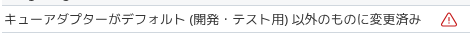
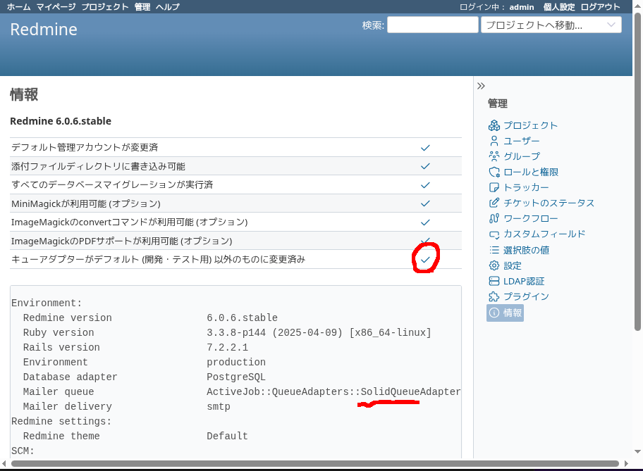
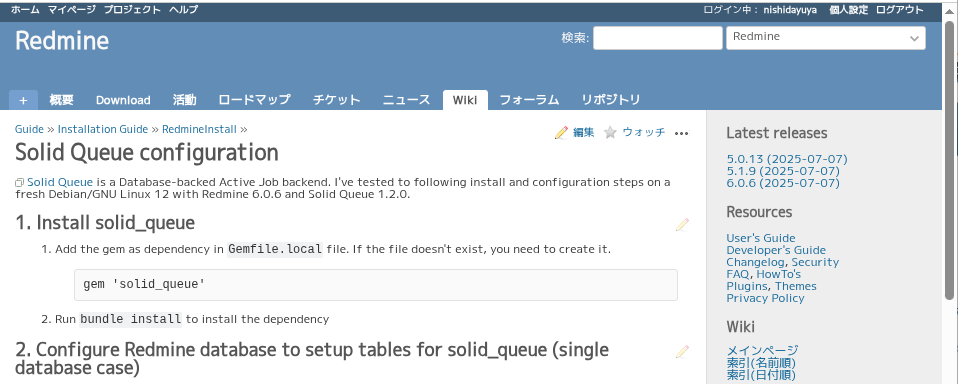

# Redmine × Solid Queue: 安心簡単キュー構成

author
:   西田雄也

date
:   2025-07-25
    REDMINE JAPAN vol.4

allotted-time
:   7m

theme
:   local_theme

start-time
:   2025-07-25

end-time
:   2025-07-25

# 背景: キューアダプター

- https://www.redmine.org/projects/redmine/wiki/RedmineInstall#Queues-adapter より，

```
Redmine uses ActiveJob::QueueAdapters::AsyncAdapter
as default queue adapter which is not recommended
for production environment. Recommended adapter is
Sidekiq which uses Redis for persistance.
```

- RedmineはAsyncAdapterをデフォルトのキューアダプターとして使うが，本番環境では推奨しない．
- 推奨するアダプターはRedisを永続化に使うSidekiqである．

# 背景: どういうことか

- Redmineはチケットの追加や更新をメイル通知するのにデフォルトではキューアダプターにAsyncAdapterを使っている．
- AsyncAdapterはスレッドベースのため，Redmineが終了するとそのジョブが失われる．具体的にはメイルが失われる．

{:height='90'}

↓

- 実運用の例としてジョブの保存先にRedisを使うSidekiqAdapterの設定方法がredmine.orgで紹介されている．
    - https://www.redmine.org/projects/redmine/wiki/SidekiqConfiguration

# 背景: キューアダプターあれこれ

- RDBMSをバックエンドにするキューアダプター: DelayedJob, GoodJob, Solid Queue
- RDBMSで済むならSidekiqと違ってRedisが不要になる
    - ただしパフォーマンス面はRedisの方が良い
- Rails 8からSolid Queueがデフォルトのキューアダプターになった

↓

- Redmineでも使って楽しよう！

# 手順: 準備

1. Gemfile.localに`gem "solid_queue"`
1. 実行: `bundle && bin/rails solid_queue:install`
1. db/migrate/年月日時分秒_add_solid_queue_tables.rbにdb/queue_schema.rbの内容を書く
     - 楽するためにシングルデータベースにしてます
1. 実行: `bin/rails db:migrate`
1. config/additional_environment.rbに`config.active_job.queue_adapter = :solid_queue`

# 手順: ジョブ処理プロセス実行

- 以下のようにしてスーパーバイザー（ジョブ処理のためのもろもろのプロセス実行するもの）起動

```console
$ bin/jobs start
```

- Pumaを使っている場合はRedmine起動時に合わせて起動することも可能

```ruby
# config/puma.rb
plugin :solid_queue
```

# できた！

{:height='570'}

# redmine.orgのWikiにも書いた

- https://www.redmine.org/projects/redmine/wiki/SolidQueueConfiguration

{:height='400'}

# めでたしめでたし

# いや ちょっと待ってください

# 手順

1. Gemfile.localに`gem "solid_queue"`
1. 実行: `bundle && bin/rails solid_queue:install`
1. db/migrate/年月日時分秒_add_solid_queue_tables.rbにdb/queue_schema.rbの内容を書く
1. 実行: `bin/rails db:migrate`
1. config/additional_environment.rbに`config.active_job.queue_adapter = :solid_queue`
1. このあとスーパーバイザー起動

# 手順が多い！

# もっと簡単にできないのか？

# そうだ

# 我らがRedmineは

# プラグイン機能がある

# ということで

# プラグインを書きました

- redmine_solid_queueプラグインを入れて，

```console
$ git clone \
    https://github.com/nishidayuya/redmine_solid_queue \
    plugins/redmine_solid_queue &&
  bin/rails redmine:plugins
```

- スーパーバイザーを起動するだけ

```console
$ plugins/redmine_solid_queue/bin/jobs start
```

- Pumaを使っている場合は↑も不要という親切設計
    - 別ノードにしたいから余計なお世話な場合は環境変数でdisable

# まとめ

- Solid Queueは安心簡単
- メイル通知の頻度によってはこれだけで十分
- ↓のプラグインを使えば最低2コマンド実行だけで導入可能
- https://github.com/nishidayuya/redmine_solid_queue

{:height='310'}

# 参考

- https://github.com/rails/solid_queue
- Sidekiq vs Solid Queue
    - https://kaigionrails.org/2024/talks/willnet/
- Redis不要のSolid QueueはSidekiq OSSに勝てるのか？Rails 8で非同期処理を徹底比較
    - https://zenn.dev/counterworks/articles/a899a4f6a621e9
- (How I) Deploy Solid Queue with Capistrano
    - https://world.hey.com/robzolkos/how-i-deploy-solid-queue-with-capistrano-487b4a31

# 自己紹介: 西田雄也 @nishidayuya

- ネットワーク応用通信研究所所属プログラマ
- 作ったことがあるRedmineプラグイン
    - redmine_text_format_converter: TextileからMarkdownへ変換
    - redmine_ruby_wasm: Redmine上でRubyのコードを実行
    - The Never Deleting Story a.k.a. 絶対削除させないマン
    - redmine_solid_queue (new!)

{:height='230'}
